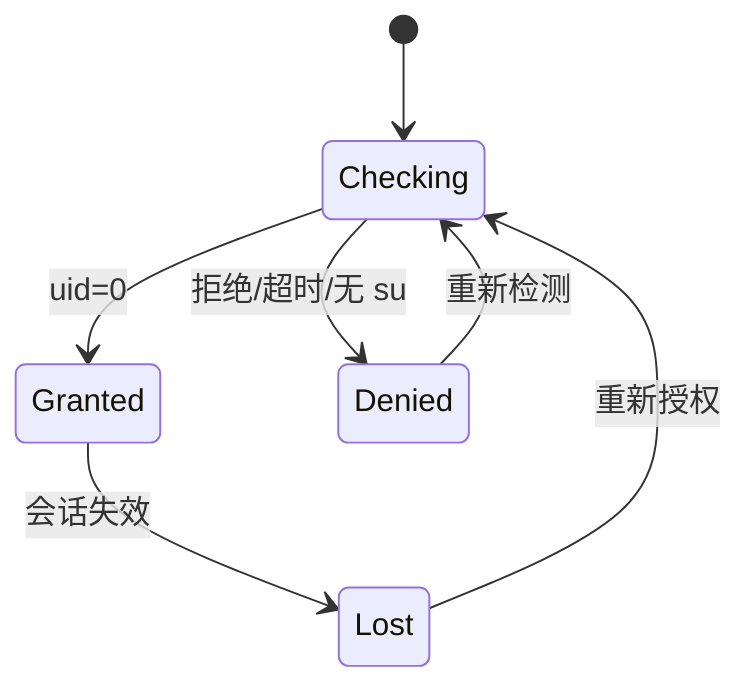

# iSaver 系统设计文档（SDD）

> 文档版本：4.8
> 更新日期：2026-08-14

> 2026-08-14 性能与模块化实现同步：远程协议、凭据、安全策略、ViewModel 与测试整体迁入独立 `:remote` Android library，远程 basename 使用模块内 `RemoteEntryName`，避免反向依赖 `:app` 领域层。当前 `:app` 不声明 `implementation(project(":remote"))`，也不再携带 Commons Net/JSch、远程 Application 单例、Activity 状态收集或 Browser 对话框。Release 启用 R8 `proguard-android-optimize.txt` 与资源收缩，仅抑制归档依赖可选的 `StaticLoggerBinder` 告警；`verify_apk_size.ps1` 限制 APK 不超过 8 MiB，并从最终 DEX 拒绝 `org.apache.commons.net`、`com.jcraft.jsch` 和 `com.iamxpp.isaver.remote`。本轮 unsigned Release 为 3,798,909 bytes，Debug 从 34,713,852 降至 33,669,702 bytes。95 个套件、650 个 JVM 测试及小米 9 完整发布门禁通过；当前 200 项冷/热、缓存和 1000 项首批可见 P95 分别为 104.73、98.40、13.30 和 211.19 ms。

> 2026-08-14 M9 本地发布门禁实现同步：发布脚本串行执行 648 个 JVM 测试、Lint、四 ABI native/Debug/AndroidTest 构建、23 组小米 9 instrumentation、共享存储可见工作流与 Root 性能测试，并对每组 instrumentation 设置 180 秒上限。10,000 项读取、512 MiB Hex/SHA-256、共享存储解压和 1000 项分页均通过；自然名称排序键改为每条目预计算一次后，首屏 P95 从 554.28 ms 降至 219.19 ms。API 29/33/35 本轮 Emulator 兼容回归通过。写任务固定 `NEVER_REPLAY`，进程死亡转 `NEEDS_REVIEW`，不确定提交不重放；完整风险矩阵见 `docs/audits/2026-08-14-m9-local-release-audit.md`。远程常量保持关闭。

> 2026-08-14 M8-D 权限修改实现同步：`FilePermissionRepository` 只接收 `FilePermissions` typed 九位 rwx 模型，UI 使用九个复选框和 600/644/700/755 预设，不传入命令或自由八进制文本。`RootFileSystem.changeMode` 在 helper 调度前复核直接父项、类型、符号链接、完整 `RootFileMetadata` 和保护路径；固定 `chmod-bound` 通过已绑定 original/canonical 父目录 FD、来源 device/inode/type 和旧 mode 打开目标 FD，以 `fchmod` 修改后同时从 FD 和路径复核 mode、UID/GID、identity 与类型。helper 调度后的等待和事后复核不可取消，超时、退出 55/137、协议异常或复核失败返回 `OUTCOME_UNCERTAIN` 且不自动重放。首版只提供单项非递归修改，拒绝特殊权限位、R3/R4 路径、symlink 和特殊项目；私有应用路径或放宽 group/other 写权限需要二次确认。全量 645 个 JVM 测试、Lint、四 ABI native、Debug/AndroidTest 构建及小米 9 Root 1/1、竖屏 UI 验收通过，M8 完成。

> 2026-08-13 M8-C 文件工具实现同步：新增独立 `filetools` 模块。`HexViewerRepository` 每页只调用一次 typed `readRange`，默认 4 KiB、16 字节一行，首次读取建立完整 `RootFileVersion`，分页时严格匹配 size/device/inode/mtime/ctime；空文件使用零长度版本探测，偏移按页向下对齐。`FileComparisonRepository` 先对两侧做零长度版本探测，再以 1 MiB 分块流式比较，相同大小时返回首个不同字节和最多 16 字节上下文，任何块长度或版本变化返回 `OUTCOME_UNCERTAIN`；摘要比较复用 `FileChecksumRepository` 四算法。`FileToolsViewModel` 只保存结构化页与结论，全屏 Compose 不持有 Root 接口；单窗长按进入 Hex，单窗/双窗恰好两项选择进入比较。小米 9 隔离 Root 专项和竖屏 UI 已验收。

> 2026-08-13 M8-B 文本编辑实现同步：`TextEditorRepository` 以 1 MiB typed range 分块读取最多 2 MiB 普通文件，并要求所有块携带同一 `RootFileVersion`；`TextDocumentCodec` 严格处理 UTF-8、UTF-16 LE/BE、GB18030、BOM 与三种换行符。`TextDraftStore` 使用 SHA-256 路径哈希文件名和绑定版本的应用私有二进制草稿，不把路径或内容写入 DataStore。保存内容先进入 UUID 私有 cache，经 `IncomingStreamRegistry` 签发一次性能力，再调用 `RootFileSystem.replaceFileAtomically`。固定 native helper 绑定父目录及来源完整版本，在同目录创建 `O_EXCL|O_NOFOLLOW` 临时文件、精确读取 stdin、保留 mode/UID/GID、`fsync` 并复核；POSIX 通过 `RENAME_EXCHANGE` 保留旧对象直至验证，emulated storage 在不支持 exchange 时仅使用经过来源再校验的 rename，并重开目标、逐字节比较、复核属性和稳定 stat。结果不确定不自动重试。
> 对应需求：iSaver PRD 4.5

> 2026-08-13 M8-A 双窗口完成基线：`DualPaneViewModel` 只持久化显示、活动窗和锁定状态，两个独立 `BrowserViewModel` 分别使用默认及 `secondary.*` DataStore key 保存显示偏好与路径历史。竖屏 Compose 布局上下分割，横屏左右分割；双窗向 `BrowserScreen` 注入强制列表和紧凑页头，不写回单窗 `DisplayMode`。跨窗复制/移动只调用现有 `FileCopyRepository`/`FileMoveRepository`，目标能力、同路径和锁定状态均在提交前门禁，完成后双窗共同刷新。小米 9 已通过真实 Root 流程；MIUI Compose runner 仍因测试宿主 Activity 未切前台而超时，不计为通过。

> 2026-08-13 M7.1 完成基线：Room 8 已实现统一 `VirtualViewNode` 应用层树，明确区分 `VIRTUAL_FOLDER` 与 `REAL_REFERENCE`。虚拟节点不实现 `RootPath`，不进入 Root 写入 API；分享保存和文件操作目标能力由显式 destination 类型决定。Room 7 的 `custom_locations` 与 `bookmarks` 已原子迁移为“未分组”下的真实叶子引用，当前写入只进入 `virtual_view_nodes`。Repository 已实现父类型约束、循环检测、同父去重、引用重定位和 identity 批量更新。

> 2026-08-13 M6/M7 完成基线：本地核心仓库均通过 typed Kotlin API 调用固定 Root helper。文件与受限目录树复制/移动、可恢复替换、递归目录合并、回收站、恢复冲突、批量重命名、搜索、预览、属性/四算法校验、文件/目录书签、跨进程路径会话和分享均已接入。`LocalArchiveEngine.createArchive` 统一创建 ZIP/TAR/TAR.GZ/7Z，解压统一写入脱敏任务；多选支持全选、反选和同类选择。全量 579 个 JVM 测试、Lint、Debug/AndroidTest 构建通过；小米 9 会话/Room/Root 书签 3/3、Root 流 7/7、归档/目录专项 4/4 通过，最终冷启动无 AndroidRuntime 崩溃。单个 Compose UI 专项在 MIUI runner 超时且无 JUnit 结果，不计为通过。该段记录当时 M8 尚未实施的状态；M8 与 M9 后续均已完成，远程适配器仍仅维护且 UI 继续隐藏。

> 2026-08-13 M7 预览、目录分享与冲突同步：新增 `RootPreviewRepository`，仅对纯文本和常见图片使用 typed `readRange`，最大文本 512 KiB、图片 16 MiB，所有块必须匹配同一 `RootFileVersion`；UI 只接收内存中的只读预览模型，不接触 Root 路径。新增目录分享协调层：先由 `ArchiveRepository` 在 app-private incoming cache 生成 ZIP，再由 `RootExportRepository` 复制到 export cache 并签发一次性只读 `content://` grant，授权签发后清理归档中间文件。`TrashRepository.restore` 增加取消、保留两者和显式改名恢复，只有成功移动后才删除 journal。`DirectoryMergeRepository` 通过 typed 目录读取和现有无覆盖复制/移动原语递归处理同名目录，拒绝 symlink/特殊文件，移动完成后仅删除已验证空源目录。

> 2026-08-12 实现同步：分享入口拆分为“打开文件所在位置”和“保存到 iSaver”两个透明转发 Activity，并汇入 `singleTop` 主 Activity；保存目标继续使用 Hilt `TransferViewModel`、2 秒 Provider 解析边界、即时私有 cache、一次性 Root/Shell 流能力、单 publish 不可取消窗口、最多一个 queued generation 和 24 小时 orphan TTL；打开位置目标仅对 allowlist 微信 FileProvider 路径恢复父目录。M4 已加入本地归档引擎、Root-aware `ArchiveRepository`、Root-to-private-cache 读取桥和浏览器选择/ZIP 名称对话框。M6 默认打开和单/多普通文件对外分享切片已加入私有 `export` cache、分别为 60 秒和 30 分钟的一次性 256 位 token、私有只读 `ExternalFileProvider`、扩展名 MIME 映射、`ACTION_VIEW`、`ACTION_SEND` 与 `ACTION_SEND_MULTIPLE`；多选混入目录或不可读项目时不发起导出，部分导出失败撤销已创建 grant。M6 单文件移动切片已加入 `FileMoveRepository`、typed `RootFileSystem.moveFileNoReplace`、三标签目标选择状态及固定参数 native `move-noreplace`、`move-cross-device-noreplace`：同盘通过父目录 FD、来源 identity 与 `renameat2(RENAME_NOREPLACE)` 原子移动；跨盘复用 stage 复制发布，在目标身份确认后再次核对来源 FD/路径 identity、类型、大小与时间戳并精确删源，删源失败返回 `MOVE_PARTIAL`。M6 单文件复制首切片已加入 `FileCopyRepository`、typed `RootFileSystem.copyFileNoReplace`、复制目标状态和固定参数 native `copy-file-publish`；来源通过父目录 FD、`O_NOFOLLOW`、identity、大小与时间戳复核，目标复用 stage、字节数校验和无覆盖发布，支持同盘及共享存储跨盘复制。M6 单文件重命名首切片已加入 `FileRenameRepository`、typed `RootFileSystem.renameFileNoReplace` 和固定参数 native `rename-noreplace`：同一真实父目录内重新校验来源 regular-file、canonical path、device/inode 和目标不存在，再用 `renameat2(RENAME_NOREPLACE)` 改名并 `fsync` 父目录。小米 9 已通过 Root stream、单/多文件分享、移动后端、重命名后端及长按专项。文件头 MIME 识别、显式“打开方式”、目录/多选复制移动/重命名和其余 `fileops` 能力仍待后续切片。远程协议适配器代码保留，但新增开发和产品 UI 均冻结，只有本地 0.2.0 至 0.5.x 全部门禁通过后才进入远程闭环；debug 构建包含固定分享测试 Provider，仅用于自动化 `content://` 验收；生产流 Provider 只暴露不可枚举的一次性只读能力。

> 2026-08-12 新建文件同步：`RootFileSystem.createFileNoReplace` 和固定 native `create-file-noreplace` 已落地。Kotlin 先通过 `prepareWritableDirectory` 绑定原始/真实父目录及 identity，并拒绝保护路径和已存在目标；native 只接受固定参数，使用父目录 FD 与 `openat(O_WRONLY|O_CREAT|O_EXCL|O_NOFOLLOW|O_CLOEXEC, 0600)` 创建空文件、同步文件和父目录并返回 identity；Kotlin 再复核目标类型、零字节、identity 和父目录映射。普通浏览 UI 提供独立对话框，目标选择器保持只允许新建文件夹。

> 2026-08-12 文件打开同步：`RootExportRepository` 在 Root 文件原子复制到私有 export cache 并验证 identity/size 后，读取最多 64 字节文件头进行 MIME 修正；不对 Root 源执行第二次读取。普通点击发送直接 `ACTION_VIEW`，长按“打开方式”使用 `Intent.createChooser` 包装同一只读 Intent；URI 继续保持不可枚举、一次性、短 TTL，失败启动立即撤销授权。

> 2026-08-12 目录复制移动同步：`RootFileSystem.copyEntryAsNoReplace` / `moveEntryAsNoReplace` 按条目类型分派普通文件或目录，`FileCopyRepository` / `FileMoveRepository` 统一使用现有冲突名称解析。固定 helper 新增 `copy-directory-publish`、`move-directory-noreplace` 和 `move-directory-cross-device-noreplace`；受限 walker 通过目录 FD、`openat`、`fstatat(AT_SYMLINK_NOFOLLOW)`、identity/版本复核和硬资源上限处理目录树，不调用 `cp -r`、`mv`、`rm -rf` 或任意 `sh -c`。同盘移动原子无覆盖；跨盘先发布完整目标再精确删源，删源不完整返回 `MOVE_PARTIAL`。共享存储不支持 `RENAME_NOREPLACE` 时，独占创建最终目录后通过已绑定 FD 从 stage 安全复制并精确清理 stage，不覆盖既有目标。目录专项已在小米 9 通过。

> 2026-08-12 目录重命名同步：`RootFileSystem.renameEntryNoReplace` 和 `FileRenameRepository` 支持普通文件或目录，仍拒绝符号链接、特殊条目和保护路径。固定 `rename-noreplace` 在同一已绑定父目录 FD 内复核来源类型与 identity，使用 `renameat2(RENAME_NOREPLACE)`，并复核目标类型/identity、旧名消失及父目录同步。目录重命名后端和 Compose 操作面板已在小米 9 通过。

> 2026-08-12 冲突处理同步：`ConflictAction` 已提供 `CANCEL`、`SKIP`、`KEEP_BOTH`，`BrowserViewModel` 在批量普通文件复制/移动遇到明确同名时保存当前索引、已完成项和目标目录并暂停，允许逐项决策或将跳过/保留两者仅应用到当前任务后续项目。`RootFileSystem.moveFileAsNoReplace` 与 `copyFileAsNoReplace` 显式接收目标 `EntryName`；同盘 native helper 分离 source/target basename，跨盘 stage 复用显式 final name。Repository 只在 `ALREADY_EXISTS` 时调用 `TargetNameResolver` 递增 `(n)`，任何不确定结果和其他失败都不重试。明确替换、目录合并、持久 journal 与进程死亡恢复仍未实现。

> 2026-08-12 批量重命名同步：`BatchRenamePlanner` 对查找替换、前后缀、序号、大小写和正则生成稳定顺序的完整计划，并在执行前验证名称、重复目标、未选项目冲突与无变化计划。`BatchRenameExecutor` 只调用 typed `FileRenameRepository.rename`，先将变化项逐个改为不可预测临时名，再提交最终名称；确定失败进行逆序补偿，任一补偿失败或底层返回 `OUTCOME_UNCERTAIN` 时不继续猜测，要求用户刷新目录核对。Compose 对话框在预览生成前禁用执行，选择变化后强制重新预览。小米 9 已通过两文件交换名称后端和预览门禁 UI 专项。

> 2026-08-12 任务中心同步：数据库升级到 Room 3，`OperationTaskRepository` 持久化脱敏任务类型、状态、项目计数、恢复策略和消息。当前复制/移动从开始、逐项进度、冲突暂停到终态共用同一 task ID；确定跳过显示部分成功，异常按失败/部分成功/结果不确定分类。启动 reconciliation 将遗留的等待、运行、暂停和取消中写任务改为 `NEEDS_REVIEW`，`NEVER_REPLAY` 策略禁止自动重放。Compose 任务中心显示持久状态并可清理终态任务。小米 9 已通过 Room 2→3 迁移、任务中心 UI 和 Root 操作回归。

> 2026-08-12 回收站与永久删除同步：数据库升级到 Room 4，`TrashRepository` 在文件系统变更前写入 `PENDING` 日志，发布并复核 trash identity 后转为 `ACTIVE`，不确定结果转为 `NEEDS_REVIEW`。默认回收范围限于共享存储，恢复调用 typed 无覆盖移动并只在成功后删除日志。`RootFileSystem.identity` 与 `deleteEntryPermanently` 通过固定 native `delete-entry-bound` 绑定 canonical parent、父目录 device/inode 和来源 device/inode；受限 walker 不跟随符号链接且只接受普通文件/目录。共享 FUSE 的无覆盖 rename 返回 `EIO`、`ENOSYS`、`EINVAL` 或 `EOPNOTSUPP` 时，native helper 返回跨设备分支标记，由 Kotlin 复用已验证的 stage copy-publish 与精确删源实现。Compose 提供删除选择、永久删除二次确认、回收站恢复/永久删除和任务记录。清空、批量操作和更完整恢复冲突 UI 后续实现。

> 2026-08-12 复制元数据同步：固定 native copy helper 新增 FD 级 `futimens` mtime 继承。普通文件在来源 identity/size/mtime/ctime 二次复核后设置 stage payload 时间，再执行 fsync 与无覆盖发布；FUSE reservation copy 从 payload 的 mtime 继续设置最终文件。目录 walker 在每个普通文件复制完成后设置文件 mtime，并在递归返回和来源目录版本复核后设置目标目录 mtime，因此根目录和所有子目录均按自底向上顺序保留。任何时间设置错误按写失败处理并清理未发布 stage。

> 2026-08-12 任务控制同步：数据库升级到 Room 5，`operation_tasks.totalBytes` 可空，`completedBytes` 单调保存已完成普通文件大小；目录批次保持 unknown total。`BrowserViewModel` 只允许控制当前进程持有的 copy/move Job，以 `MutableStateFlow` 在项目边界等待暂停，继续同一协程和 task ID。取消先持久化 `CANCELLING` 再取消 Job；Root coordinator 对已派发写命令的既有不可取消等待与 reconciliation 语义不变，catch 路径在 `NonCancellable` 中写入 `CANCELLED`。任务中心仅为 owned task 渲染暂停/继续/取消。

> 2026-08-12 可恢复替换同步：`ConflictAction.REPLACE` 由统一 `RecoverableReplaceRepository` 执行，不新增覆盖型 native 原语。仓库先 stat 同名目标，再调用 `TrashRepository.recycle` 完成日志和 identity 复核，随后调用 copy/move 的 `*EntryAsNoReplace` 发布同名来源。发布确定失败触发 `TrashRepository.restore`；恢复成功返回原发布失败，恢复失败转 `OUTCOME_UNCERTAIN`。成功替换不删除 trash journal，因此旧版本保持用户可恢复。该能力仅覆盖共享存储，私有/系统位置不执行跨边界备份。

> 2026-08-13 多算法校验和与精确属性同步：`FileChecksumRepository` 只接受可读普通非符号链接文件，通过 typed `RootFileSystem.readRange` 调用固定 native `read-file-range`，以 4 MiB 为上限逐块把字节送入用户选择的 MD5、SHA-1、SHA-256 或 SHA-512 `MessageDigest`，默认 SHA-256，不落地缓存。每个响应携带 device/inode/size/mtime/ctime 版本，Kotlin 要求所有块版本一致，native 在 `pread` 前后复核同一 FD；空文件仍执行一次零长度读取。由此移除旧 `read-file-stdout` 的 256 MiB 单文件限制而不提高单次命令输出上限。`RootFileSystem.metadata` 使用固定 `file-metadata` 和 `fstat` 返回 mode/uid/gid/device/inode，ViewModel 再调用 typed `identity` 确认路径仍绑定同一对象后才展示。关闭属性页会取消属性与校验任务。

> 2026-08-13 M7 历史基线：Room 7 的 `BookmarkEntity` 曾保存显示名、类型、device/inode 和可用状态；M7.1 已将其作为只读迁移来源并入 `virtual_view_nodes`，UI 与 ViewModel 不再写入旧表。独立 `BrowserSessionRepository` 继续保存根路径、当前路径和前后栈，恢复前重新复核 Root 目录，不保存选择、弹窗或 in-flight 写操作。

> 2026-08-12 批量回收站同步：`TrashRepository.recycleAll`、`restoreAll` 和 `deletePermanentlyAll` 只顺序编排既有 typed 单项原语，不新增批量 shell/native 命令；每项继续执行来源/回收 identity 复核和无覆盖移动或绑定删除。`TrashBatchResult` 返回完成数与首个失败，后续项目不再派发，DAO 记录仅在对应文件系统操作成功后删除。ViewModel 将恢复记为独立 `RESTORE` 任务，批量回收失败后刷新并恢复失败项及未执行项选择。Compose 对批量删除和清空回收站分别确认，`NEEDS_REVIEW` 永不进入自动批次。小米 9 已通过真实两文件批量闭环。

> 2026-08-13 深度搜索同步：`LocalSearchRepository` 接收 typed `LocalSearchCriteria`，在 `Dispatchers.IO` 上以单协程 BFS 顺序调用 `RootFileSystem.readDirectory`，不增加 native 递归命令，不把用户输入拼接进 shell。过滤器支持名称/忽略大小写正则、扩展名、类型、大小范围和修改时间；正则在任何 Root I/O 前编译。扫描不跟随符号链接，不进入不可读目录，子目录读取失败计数后继续；固定限制为深度 32、扫描 10,000 项、结果 1,000 项，每个目录后 `yield` 并检查取消。ViewModel 将进度、取消和 `SEARCH` 任务状态写回 UI；结果点击解析 typed 父路径后通过普通 `openRoot` 打开所在位置。保存、移动、复制和解压目标选择器隐藏入口。

## 1. 设计目标

iSaver 首版是面向 Root Android 设备的现代文件管理器。系统融合 iOS Files 的“位置”信息架构和 MT 的高效率文件操作，把微信等应用的多个真实存储目录聚合成可理解的入口，同时允许用户进入完整 Root 文件系统并进行可恢复、可审计的文件操作。

系统同时保留分享另存能力：从第三方应用接收 `content://` Uri，在 iSaver 内选择 Root 目录并完成安全写入。

设计重点：

- Root 是首版运行前提，无 Root 时阻断核心功能。
- 页面只理解统一的目录和位置模型，不直接拼接 Shell 命令。
- Root 命令集中封装并防止路径注入、转义错误和半成品文件。
- 应用路径使用可维护模板和运行时探测，不依赖单一硬编码路径。
- 先完成小米 9 / Android 11 真机闭环，再扩展兼容范围。
- 0.1.x 保持当前已验证基线；0.2.0+ 的文件操作通过独立 `fileops`、`export` 和 `tasks` 模块逐步接入。
- 本地文件管理器完成前，`remote` 代码只做必要维护，不初始化产品入口、不新增协议功能，也不占用本地里程碑排期。

## 2. 技术栈与工程约束

### 2.1 推荐技术栈

- 语言：Kotlin。
- UI：Jetpack Compose + Material 3 基础能力，自定义 iOS Files 风格组件。
- 架构：单 Activity、Navigation Compose、MVVM、单向数据流。
- 依赖注入：Hilt。
- 异步：Kotlin Coroutines + Flow。
- 持久化：Room；轻量设置可使用 DataStore。
- Root：`topjohnwu/libsu`，版本由 Gradle Version Catalog 统一管理。
- 测试：JUnit、MockK 或测试替身、Turbine、Compose UI Test。
- 最低系统：Android 10（API 29）。
- 首台设备：小米 9 透明尊享版，Android 11（API 30）。

### 2.2 首版明确不采用

- 不实现 SAF、MediaStore 目录树、Shizuku 或非 Root 降级后端。
- 不在 Activity、Composable 或 ViewModel 中执行 `Runtime.exec("su")`。
- 不用字符串拼接的 `su -c "..."` 执行包含用户路径的命令。
- 不通过 `chmod 777`、递归 `chown` 等方式绕过权限设计。
- 不引入独立 Root 守护进程或复杂 Binder 服务。
- 允许随 APK 构建一个非驻留、固定子命令的 native 文件操作 helper；它只能执行经过 allowlist 的只读目录枚举、复制到临时文件、单文件 stage 无覆盖复制、原子无覆盖发布、单文件同盘原子移动、跨盘发布后按 identity 删源和精确临时文件清理，不能执行任意命令。

0.1.x 仅启用已验证的浏览、建目录、归档和另存操作；0.2.0+ 扩展的复制、移动、重命名、删除、回收站、Root 文件导出和任务中心必须继续通过同一 typed helper 边界实现，不能恢复为任意 Shell 命令。

## 3. 总体架构

```text
app
├─ entry
│  ├─ MainActivity
│  ├─ ShareTargetForwardingActivity
│  ├─ ShareTarget
│  └─ ShareIntentParser
├─ rootgate
│  ├─ RootGateViewModel
│  └─ RootRequiredScreen
├─ locations
│  ├─ LocationHomeViewModel
│  ├─ LocationCatalog
│  ├─ AppPathTemplate
│  └─ CustomLocationRepository
├─ browser
│  ├─ BrowserViewModel
│  ├─ BrowserUiState
│  └─ ui
├─ archive
│  ├─ ArchiveRepository
│  ├─ ArchiveInspector
│  └─ ArchiveProgress
├─ remote
│  ├─ RemoteConnectionRepository
│  ├─ RemoteFileSystem
│  └─ CredentialCipher
├─ transfer
│  ├─ TransferViewModel
│  ├─ OutputNameDraft
│  ├─ IncomingFileCache
│  ├─ IncomingStreamRegistry
│  ├─ IncomingStreamProvider
│  ├─ RootFileTransferRepository
│  └─ TransferProgress
├─ fileops
│  ├─ FileOperationRepository
│  ├─ OperationPlanner
│  ├─ OperationExecutor
│  ├─ OperationJournal
│  ├─ ConflictResolver
│  ├─ RiskPolicy
│  └─ TrashRepository
├─ export
│  ├─ RootExportRepository
│  ├─ ExportCache
│  ├─ ExportRegistry
│  ├─ ExternalFileProvider
│  └─ MimeResolver
├─ picker
│  ├─ DestinationPickerViewModel
│  └─ DestinationPickerScreen
├─ tasks
│  ├─ TaskRepository
│  ├─ TaskScheduler
│  └─ TaskCenterScreen
├─ domain
│  ├─ StorageLocation
│  ├─ DirectoryEntry
│  ├─ RootPath
│  └─ OperationResult
├─ data
│  ├─ root
│  │  ├─ RootSession
│  │  ├─ RootFileSystem
│  │  ├─ LibsuRootSession
│  │  └─ RootCommandCodec
│  └─ local
│     ├─ ISaverDatabase
│     └─ LocationDao
└─ diagnostics
   └─ SafeLogger
```

### 3.1 分层职责

| 层级 | 职责 |
| --- | --- |
| Entry | 解析普通启动与分享 Intent，建立导航入口 |
| Root Gate | 检查 Root，控制阻断页和重试 |
| Locations | 生成最近、应用、通用和虚拟视图位置 |
| Browser | 管理目录导航、列表、空态、错误和新建目录 |
| Archive | ZIP 创建与多格式安全浏览/解压 |
| Remote | 适配器代码保留；本地 0.2.0 至 0.5.x 发布门禁通过前不接入产品 UI 或新增能力 |
| Transfer | 将来源 Uri 缓存并安全写入 Root 目标 |
| FileOps | 规划、执行、恢复和报告复制/移动/删除/重命名 |
| Export | 将 Root 文件安全暴露为临时 `content://` URI |
| Picker/Tasks | 选择目标目录、展示冲突和管理长任务 |
| Domain | 定义不依赖 Android UI 的核心模型 |
| Data/Root | 唯一允许调用 libsu 和构造 Root 操作的区域 |
| Data/Local | 保存虚拟视图树、最近位置、任务和迁移来源 |

## 4. 核心数据模型

### 4.1 RootPath

禁止在业务层到处传递未校验字符串。所有 Root 路径先构造为值对象：

```kotlin
@JvmInline
value class RootPath private constructor(val value: String) {
    companion object {
        fun parse(raw: String): Result<RootPath> {
            if (!raw.startsWith('/')) {
                return Result.failure(IllegalArgumentException("必须使用绝对路径"))
            }
            if (raw.contains('\u0000')) {
                return Result.failure(IllegalArgumentException("路径包含非法字符"))
            }
            return Result.success(RootPath(raw))
        }
    }
}
```

`RootPath` 只证明字符串是以 `/` 开头且不含 NUL 的 Android POSIX 绝对路径，不做 `trim`、斜线折叠、`.`/`..` 解析或尾斜线删除，避免改变真实目标语义。真实路径、canonical path、符号链接、目录类型和权限必须由 `RootFileSystem.stat()` 再确认。

### 4.2 StorageLocation

```kotlin
sealed interface StorageLocation {
    val id: String
    val displayName: String

    data class Direct(
        override val id: String,
        override val displayName: String,
        val path: RootPath,
        val source: Source
    ) : StorageLocation

    data class Group(
        override val id: String,
        override val displayName: String,
        val children: List<Direct>
    ) : StorageLocation

    enum class Source { BUILT_IN, APP_TEMPLATE, CUSTOM, RECENT }
}
```

### 4.3 DirectoryEntry

```kotlin
data class DirectoryEntry(
    val path: RootPath,
    val name: String,
    val type: EntryType,
    val sizeBytes: Long?,
    val modifiedAtEpochSeconds: Long?,
    val readable: Boolean,
    val writable: Boolean,
    val symbolicLink: Boolean
)

enum class EntryType { DIRECTORY, FILE, OTHER }
```

### 4.4 操作结果

```kotlin
sealed interface OperationResult<out T> {
    data class Success<T>(val value: T) : OperationResult<T>
    data class Failure(
        val code: ErrorCode,
        val userMessage: String,
        val technicalMessage: String? = null
    ) : OperationResult<Nothing>
}
```

错误码至少包含：`ROOT_DENIED`、`ROOT_UNAVAILABLE`、`NOT_FOUND`、`NOT_DIRECTORY`、`NOT_READABLE`、`NOT_WRITABLE`、`ALREADY_EXISTS`、`NO_SPACE`、`SOURCE_UNREADABLE`、`COMMAND_FAILED`、`CANCELLED`。

## 5. Root 访问设计

### 5.1 RootSession 接口

```kotlin
interface RootSession {
    suspend fun check(): RootStatus
    suspend fun execute(operation: RootOperation): RootExecution
    fun invalidate()
}

sealed interface RootStatus {
    data object Available : RootStatus
    data class Unavailable(val reason: String) : RootStatus
}
```

`LibsuRootSession` 是首版唯一实现。上层依赖接口，以便 JVM 测试使用假实现。

### 5.2 RootOperation

业务层不得传入完整命令字符串。数据层接收结构化操作：

```kotlin
sealed interface RootOperation {
    data class Stat(val path: RootPath) : RootOperation
    data class ListDirectory(val path: RootPath) : RootOperation
    data class CreateDirectory(val parent: RootPath, val name: String) : RootOperation
    data class Move(val source: RootPath, val target: RootPath) : RootOperation
    data class RemoveTemporary(val path: RootPath) : RootOperation
}
```

首版不暴露通用 `run(command: String)` 给 UI、ViewModel 或普通 Repository。

### 5.3 命令安全

- 使用 libsu 的 Shell API 管理授权、进程和退出码。
- 所有路径参数经过 `RootCommandCodec.quoteArgument()` 单引号引用，并将内部单引号转换为安全序列。
- 固定命令与用户参数分离构造；禁止二次 `sh -c`。
- 目录列表优先使用可解析且支持空字符分隔的输出格式，避免空格和换行文件名破坏协议。
- 解析失败返回结构化错误，不猜测或跳过危险条目。
- 每次写操作前重新 `stat` 父目录，确认仍是预期目录且可写。
- 不跟随未知符号链接执行递归写操作；首版没有递归写操作。

对“分享另存”的关键写入不依赖 shell 的检查后 `mv`。`toybox mv -n` 在 Android 11 上仍可能是检查后 rename，无法提供真正的无覆盖原子性；共享存储又可能禁止硬链接。因此 APK 构建 `isaver-fs-helper`：

- `prepare-stage` 在已验证目标父目录的目录 FD 内用 `mkdirat` 原子创建 Root-owned `0700` `.isaver-stage-<uuid>`，返回并绑定其 device/inode。
- iSaver 在应用进程内为已验证的 UUID cache 签发 60 秒、一次性、256 位随机能力；导出的只读 `IncomingStreamProvider` 仅接受 UID 0/2000，首次打开即原子消费 token，并在返回只读文件描述符前复核 canonical parent、regular-file、device/inode 和精确大小。
- Root 数据层只构造固定 `content read --uri <能力 URI> | copy-publish-stdin` 管道。`copy-publish-stdin` 重新打开并验证父目录与 stage 目录身份、owner 和权限，在 stage 内以 `O_EXCL` 创建 `0600` payload，从 stdin 精确读取声明字节数，拒绝提前 EOF 或额外字节，随后 `fsync`、校验大小，并在同一进程持有已验证 FD 的情况下使用 `renameat2(..., RENAME_NOREPLACE)` 发布到最终名称。
- 对普通 POSIX/`/data` 文件系统继续强制 Root-owned `0700` stage、`0600` payload 和 `renameat2(RENAME_NOREPLACE)`。对已识别的 FUSE/sdcardfs 共享存储，仅接受系统固定映射的 UID 0、`0770` stage、`0660` 单链接文件和无 world 权限；若 `RENAME_NOREPLACE` 返回不支持，则以 `O_EXCL` 预留最终名称，从已完整校验的 stage payload 二次复制、`fsync`、复核最终身份与大小后清理 stage。该兼容路径不覆盖既有文件，碰撞仍交给 `(n)` 重名策略。
- `remove-stage` 只在父目录、stage 和 payload 身份均匹配时删除预期 payload 与空 stage 目录；取消或超时不得按路径盲删。
- 最终 rename 的结果无法确认时返回 `OUTCOME_UNCERTAIN`，不得删除可能已经发布成功的最终文件。
- `copy-publish-stdin` 由固定 `/system/bin/timeout` 包裹并使用一次性独立 Root shell；管道开启 `pipefail`，Provider/content 或 helper 任一侧失败都可观察。超时或被杀后等待该独立调用结束，再检查 final/stage 并返回不确定结果，不能永久占用全局 Root shell mutex。
- 普通非 Root 并发进程无法进入 Root-owned `0700` stage；已经拥有 Root 的恶意对手不属于应用能够防御的威胁边界。
- helper 只接受固定子命令、basename、父/stage device/inode 和大小参数；不接受来源路径、脚本或通用命令字符串。
- helper 是一次性子进程，不常驻、不监听端口、不扩大 Root 授权范围。

安全引用示例：

```kotlin
internal fun quoteArgument(value: String): String =
    require('\u0000' !in value)
    "'" + value.replace("'", "'\\''") + "'"
```

该函数只适用于单层 POSIX shell 参数引用，必须覆盖空格、中文、单引号、换行、分号、`$()`、反引号和 NUL 拒绝等测试用例。引用不会阻止 `-rf` 被目标程序解释成选项，调用固定命令时仍必须使用 `--` 或安全的固定参数位置。

### 5.4 Root 门禁状态机



- App 启动后先显示 Root 检测页，不能先加载文件数据再补权限。
- `check()` 通过 Root shell 执行 `id -u`，结果必须严格等于 `0`。
- 检测设置合理超时，UI 始终显示进行中状态。

## 6. 应用位置聚合设计

### 6.1 AppPathTemplate

```kotlin
data class AppPathTemplate(
    val id: String,
    val displayName: String,
    val packageNames: List<String>,
    val candidates: List<PathCandidate>
)

data class PathCandidate(
    val id: String,
    val displayName: String,
    val absolutePathPattern: String,
    val priority: Int
)
```

首版模板用 Kotlin 静态数据定义，避免远程配置和额外信任边界。后续增加应用时修改独立 `LocationCatalog`，不修改 UI。

### 6.2 微信模板

首批候选：

```text
/storage/emulated/0/Android/data/com.tencent.mm
/storage/emulated/0/Android/media/com.tencent.mm
/storage/emulated/0/tencent/MicroMsg
/data/user/0/com.tencent.mm
/data/data/com.tencent.mm
```

探测流程：

1. 异步并发执行 `stat`，限制并发数量。
2. 仅保留存在且为目录的候选。
3. 合并解析后指向同一 inode 或 canonical path 的重复项。
4. 标注可读、可写和用途。
5. 全部不可用时返回空态，不生成假的目录条目。

### 6.3 通用位置

首版内置：

- 内部存储：`/storage/emulated/0`
- 下载：`/storage/emulated/0/Download`
- 文档：`/storage/emulated/0/Documents`
- 图片：`/storage/emulated/0/Pictures`
- 视频：`/storage/emulated/0/Movies`

目录不存在时可以在用户确认后创建；系统关键目录不自动创建。

### 6.4 虚拟视图位置持久化

Room 8 使用 `virtual_view_nodes` 保存统一应用层树。`nodeType` 只允许 `VIRTUAL_FOLDER` 或 `REAL_REFERENCE`；虚拟文件夹保存父节点、显示名和排序，真实引用额外保存真实类型、绝对路径、device/inode 与可用状态。真实引用必须直接属于虚拟文件夹，不能成为父节点；Repository 在事务中执行父类型校验、同父同路径去重和迭代式父链循环检测。

Room 7→8 迁移只读取历史 `custom_locations` 与 `bookmarks`，将其归入自动创建的“未分组”虚拟文件夹并去重。迁移完成后当前产品流不再写入旧表。可用状态是上次校验结果；打开或作为导航入口前仍必须通过 typed Root `stat`/`identity` 重新确认。

## 7. 目录浏览设计

### 7.0 三标签信息架构

- `Recent`：最近成功访问、保存、压缩、解压或传输的项目。
- `Views`：按应用位置、虚拟视图位置、通用位置渲染；虚拟树始终位于通用位置上方，真实项目以用户备注显示，回收站仍是通用位置最后一项。`VirtualViewUiState.currentFolderId != null` 时改用独立目录内容区，标题取当前文件夹备注，顶部与实体目录复用 `FilesPageHeader`，返回父虚拟文件夹；列表/网格只渲染当前层，空状态为“此目录为空”。
- `Browse`：以 `/` 为根进入完整 Root 文件系统。

底部标签切换不改变 Root 门禁状态。每个标签维护独立的滚动位置；浏览器的路径栈只属于当前打开的浏览会话。

### 7.1 BrowserUiState

```kotlin
data class BrowserUiState(
    val currentPath: RootPath?,
    val title: String,
    val entries: List<DirectoryEntry>,
    val loading: Boolean,
    val refreshing: Boolean,
    val canWrite: Boolean,
    val error: UserFacingError?
)
```

### 7.2 加载规则

- `BrowserViewModel` 在 `Dispatchers.IO` 调用 `RootFileSystem.list()`。
- 新导航请求取消旧请求，防止快速点击时旧结果覆盖新目录。
- 目录优先，名称使用自然排序。
- 大目录先显示前一批，再增量追加或分页。
- 单个异常条目转换为不可用条目或忽略并记录脱敏诊断，不使整页失败。
- `BrowserPreferences` 使用 DataStore 保存 `LIST/GRID`、排序字段和升降序。
- 排序字段为 `DISPLAY_NAME`、`TYPE`、`MODIFIED_AT`、`SIZE`；排序必须稳定，目录未知大小不触发递归统计。

### 7.3 导航栈

Navigation Compose 管理首页、应用位置列表和浏览页。浏览页内部保存路径栈：

```text
LocationHome
  -> AppLocations(微信)
  -> Browser(/data/user/0/com.tencent.mm)
  -> Browser(.../files)
```

分享模式复用位置与目录导航数据，并由独立 `TransferViewModel` 向现有 `ISaverHomeScreen` 注入保存状态和动作；普通 `BrowserUiState` 不持有来源 Uri、缓存能力或传输状态。逻辑标签页不构成真实保存目标，进入这些页面时 `TransferViewModel.clearTarget()`；只有 `HomeDestination.Browser` 的真实目录可调用 `selectTarget()`。

### 7.4 iOS Files 高保真组件

- Compose 自绘 `FilesTopBar`、`FilesSearchField`、`FileListRow`、`FileGridCell`、`FilesBottomBar` 和 `FilesOverflowMenu`。
- `Views` 顶部使用单行紧凑 `FilesTopBar`：居中标题与右侧 overflow 对齐，左侧使用等宽导航槽保证标题几何居中；搜索框直接位于其下。
- `Views` overflow 提供虚拟文件夹创建；浏览页当前目录及文件/目录长按面板统一进入虚拟目标文件夹选择器。真实引用不允许承载子节点。
- `FilesPageHeader` 统一 Views 与所有真实目录层级：56dp 单行 TopBar、左右等宽 action slot、几何居中标题、紧贴其下的搜索框；产品页面停止使用两行大标题。
- 使用 Android 系统字体和系统状态栏；不复制 Apple 字体或受保护图标资源。
- 单窗竖屏图标模式默认三列；详细列表模式保持约 64dp 行高和细分隔线。
- 双窗允许普通手机竖屏主动开启，也支持横屏、折叠屏和平板；双窗始终锁定详细列表显示，退出后恢复各窗口的单窗显示偏好。
- 使用 ADB 截图建立视觉回归基线，检查安全区、标题、搜索框、列表密度、底栏和菜单弹层。

### 7.5 快速目录枚举

- native helper 增加固定只读 list-dir 子命令，使用 open(O_DIRECTORY|O_NOFOLLOW)、fdopendir/readdir 与 fstatat(AT_SYMLINK_NOFOLLOW) 单进程返回全部条目。
- helper 在 C 内完成 Base64 编码并输出版本化 TSV 协议，消除每条目 stat/printf/base64 子进程。
- parent 元数据与列表同次返回，Browser 不再串行追加 parent stat。
- DirectorySnapshotCache 使用进程内 16 项 LRU、2 秒 TTL；缓存命中先显示再后台刷新，写操作仍重新验证目标。
- BrowserViewModel 只在用户实际导航时加载，不在创建时无条件预读内部存储；无缓存时延迟 120ms 才展示加载提示。

## 8. 分享接收与 Root 文件写入

### 8.1 Intent 入口

`MainActivity` 只直接声明启动器入口。`OpenSharedFileLocationActivity` 与 `SaveSharedFileActivity` 分别声明单文件 ACTION_SEND 和 ACTION_VIEW content://，使用不同标签形成两个系统解析目标，再原样转发到 `singleTop` 的 `MainActivity`。分享解析规则：

- 读取 `Intent.EXTRA_STREAM`。
- ACTION_VIEW 读取 Intent.data；SEND 可兼容单项 ClipData，来源不一致时拒绝。
- 保留 `FLAG_GRANT_READ_URI_PERMISSION`。
- 通过 `ContentResolver` 查询 `OpenableColumns`。
- 只把 Uri 与展示元数据传给 ViewModel，不尝试解析真实路径。
- Provider 查询在 IO dispatcher 执行，query 使用 `CancellationSignal`，Parser 的异步入口施加 2 秒调用方超时。caller cancellation 原样传播；超时返回 `PROVIDER_TIMEOUT`，发出 signal cancel 并由 generation 忽略迟到结果。第三方 Provider 或无 CancellationSignal 的 `getType()` 可能不合作，因此不承诺终止对方进程工作。Activity 使用 singleTop/onNewIntent 接收暖启动请求，历史任务恢复不重放旧 Uri。

#### 8.1.1 双分享目标分流

- 两个导出入口使用 `Theme.NoDisplay`、`noHistory` 和 `excludeFromRecents`，不创建可见中转页，也不形成独立最近任务。
- 转发时保留 action、type、data、extras、ClipData 和来源读取授权，补充目标枚举 extra，并使用 `CLEAR_TOP | SINGLE_TOP` 汇入现有主任务。
- `ShareTarget.SAVE` 调用 `TransferViewModel.handleIntent()`，保持既有安全另存闭环。
- `ShareTarget.OPEN_LOCATION` 清理活动另存状态，仅接受微信 FileProvider authority；URI 路径段逐项拒绝空值、`.`、`..`、NUL 和嵌入斜线，并只映射已知 external/files/cache 根或微信外部目录前缀。解析成功后进入父目录，失败时停留 Views 并提示“无法识别来源目录”。
- URI 路径只用于生成候选 `RootPath`，不替代 Root 文件系统事实；实际页面加载继续由 `RootFileSystem` 检查目录存在性、类型和权限。

### 8.1.2 三标签内嵌保存模式

- 分享/打开请求始终渲染现有 `ISaverHomeScreen`，默认切换到 Views，但保留“最近项目 / 视图 / 浏览”三标签和全部位置入口。
- 顶栏标题继续使用各页面统一的 `FilesPageHeader`；保存模式把右侧 overflow 替换为“存储”，使用互斥分支保证两者不会同时出现。
- 目录可进入，文件只显示不可作为目标；当前真实目录重新 stat 为 writable directory 且非 symlink 后才可保存。处于逻辑标签页时目标为空，“存储”禁用。
- `InlineSaveBar` 紧邻 `FilesBottomBar` 上方，总高度不超过 112dp；stemDraft 与 extensionDraft 两个输入框分别编辑主文件名和扩展名，扩展名可空并允许 tar.gz，组合后通过严格 EntryName 校验。
- 保存栏、位置名称和输入文本显式使用 iSaver 浅色调色板；Activity 主题设置 `android:forceDarkAllowed=false`，避免 MIUI 夜间模式二次反色导致白字或间歇不可见。
- 默认来源名按最后一个非首尾点拆分：`archive.tar.gz` 为 `archive.tar` / `gz`，`.env` 与 `name.` 的扩展名为空；用户可独立改为 `archive` / `tar.gz`。
- 分享 Intent 到达后立即解析并在后台复制到 UUID 私有 cache；这一步可与 Root 门禁并行，但 Root 未授权前不得导航 Root 或写入。用户可在授权后继续并行选择目录；cache 未完成时保存按钮禁用。
- 成功后记录最近项目；没有 queued generation 时 finish Activity 返回来源，有 queue 时清理旧 cache 并切换新请求。进程死亡不恢复 Uri 权限，要求重新分享。

### 8.2 两阶段写入

应用进程通常不能把 `ContentResolver` 输入流作为普通文件路径交给 Root shell，MIUI SELinux 也可能拒绝 `u:r:su:s0` 直接打开应用私有 cache，因此采用内部缓存加一次性流桥接：

1. 将来源 Uri 复制到应用私有缓存 `cacheDir/incoming/<uuid>.tmp`。
2. `IncomingStreamRegistry` 复核 cache 身份并签发 60 秒一次性 `RootTransferSource`。
3. Root 数据层在目标目录创建隐藏 stage，并通过固定 Provider/content 管道把字节送入 helper stdin。
4. helper 精确校验流长度、写入并 `fsync` 目标 payload。
5. 使用 `renameat2(RENAME_NOREPLACE)` 原子无覆盖发布最终文件名。
6. 每个候选窗口在 `finally` 撤销未消费能力，并按 8.5 的确定终态、重试与不确定结果策略清理应用缓存和目标 stage。


### 8.3 应用私有缓存的 Root 可见性

应用不得假设 Root shell 可直接读取 `/data/user/0/<iSaver包名>/cache/...`；在 MIUI 的 SELinux 域中即使 `uid=0` 也可能被拒绝。内部 cache 继续保持私有权限，文件名由应用生成 UUID，不使用外部输入。`IncomingStreamProvider` 不接受文件路径，只接受内存 registry 中的 64 位小写十六进制 token；仅 UID 0/2000、只读模式和精确 `/incoming/<token>` 路径可打开。token 首次打开即消费，过期、撤销、重放、身份变化或大小变化均返回同一不可读结果，不泄露能力是否存在。

不得把明文 cache 移到共享存储，不得 `chmod`/`chown`，不得记录 token、URI、cache 路径或完整命令。每次碰撞重试必须签发新能力；失败、取消和 `OUTCOME_UNCERTAIN` 不得自动重放旧能力。

### 8.4 重名策略

`RootFileTransferRepository` 在目标目录中依次尝试：

```text
report.pdf
report (1).pdf
report (2).pdf
```

`OutputNameDraft` 验证并保留 `stem` / `extension` 字段边界；Repository 不得把合成名称再次按点拆分。`TargetNameResolver` 按 `stem + " (n)" + (extension 为空 ? "" : "." + extension)` 生成候选，例如显式 `archive` / `tar.gz` 的冲突候选是 `archive (1).tar.gz`。它不通过 `stat` 预判是否存在；真正的竞争裁决由 native `renameat2(RENAME_NOREPLACE)` 完成。只有明确返回 `ALREADY_EXISTS` 时 Repository 才选择下一个名称，限制最大尝试次数；其他错误和 `OUTCOME_UNCERTAIN` 均不得自动换名或重放。

### 8.5 取消与失败

- 每次 `RootFileSystem.transferFromStream` 调用形成一个不可取消的 in-flight publish 窗口。Repository 在每个候选窗口开始前签发一个新的 `RootTransferSource`，并在 `finally` 撤销未消费 token。窗口外取消或新请求替换旧请求时取消旧任务，并在 `NonCancellable` 精确清理来源 cache 和已知 stage；窗口内不得取消底层调用、丢弃 generation 结果、自动重放或删除来源 cache，UI 进入 Cancelling/Reconciliation 并等待本次调用返回。
- 本次调用明确返回 `ALREADY_EXISTS` 时，只有没有待处理取消或新 Intent 才生成下一候选并进入新的 publish 窗口；否则在窗口间停止并安全清理。其他 Failure 和 `OUTCOME_UNCERTAIN` 不得自动换名或重试。
- 最多保留一个 queued generation；in-flight 期间到达的新 Intent 立即解析和私有缓存但不抢占 UI，更新的 Intent 替换并清理旧 queued cache。旧请求 Success 或不可重试的确定 Failure 清理后激活 queue；可重试 Failure 必须保留前台状态，让用户选择重试旧请求或清理旧 cache 后继续 queue。
- Uncertain 在当前进程存活期间保留优先显示和 cache，用户执行“已核对并清理缓存后继续”后才清理并激活 queue 或关闭。进程死亡后只恢复提示人工检查的 RequiresReshare 脱敏摘要，cache 失去 owner 并适用 24 小时 TTL。
- `IncomingFileCache` 在进程启动时删除超过 24 小时且没有当前内存 owner 的孤儿 incoming 文件；进程死亡不从 cache 路径恢复 Uri 能力。
- Root 会话失效时不自动重复写入，避免重复文件。
- 空间不足通过退出码和 stderr 归一化为 `NO_SPACE`。
- 点击保存后重新校验来源 cache 的 regular-file/device/inode/size 身份，以及目标的 directory/writable/non-symlink/canonical identity；浏览缓存的 writable 只作 UI hint，身份变化或 Root 失效必须在 publish 前阻断。
- 保存模式仍活跃时，可重试的确定失败保留已验证来源 cache；重试只由用户显式触发，并重新校验名称、cache 与目标。除不确定结果外，取消、退出、不可重试的确定失败或可证明未发布的普通取消清理 cache；`OUTCOME_UNCERTAIN` 在进程内保留来源 cache，直到显式确认，进程死亡后按 orphan TTL 处理。
- 已成功发布但应用缓存清理失败时，保存结果仍为成功，同时携带 cleanup warning，不能诱导用户重复保存。
- Repository 只报告准备、候选发布和最终结果，不伪造 native helper 无法提供的字节百分比。

失败映射：Intent 缺失/非法、来源不可读、缓存 identity/size mismatch 为 RequiresReshare；`PROVIDER_TIMEOUT` 在 Uri capability 仍存活时可显式重试。应用 cache 空间/写入失败可显式重新缓存。目标非目录、不可写、symlink 或 canonical identity 改变时保留 cache 并返回 Choosing；Root 丢失保留 cache 并回到 Root gate。publish 的确定 NO_SPACE、NOT_WRITABLE、COMMAND_FAILED 在 Root 层精确清理 stage 后保留 cache，等待用户显式重试；Uncertain 在进程内保留到确认、进程死亡后适用 orphan TTL；Success 清理 cache，失败只附 cleanup warning。

## 9. UI 设计

### 9.1 页面组件

```text
ISaverApp
├─ RootGateScreen
├─ LocationHomeScreen
│  ├─ RecentSection
│  ├─ AppLocationsSection
│  ├─ CommonLocationsSection
│  └─ CustomLocationsSection
├─ AppLocationListScreen
├─ ISaverHomeScreen
│  ├─ TransferViewModel 保存状态注入
│  ├─ InlineSaveBar
│  ├─ FilesSaveAction
│  └─ FilesBottomBar
├─ BrowserScreen
│  ├─ IOSNavigationBar
│  ├─ DirectoryList
│  └─ EmptyState
└─ CustomLocationDialog
```

### 9.2 状态要求

每个页面必须具备：加载态、空态、成功态和错误态。所有按钮在进行写操作时防重复点击。

### 9.3 iOS Files 视觉

| 项目 | 值 |
| --- | --- |
| 页面背景 | `#F2F2F7` |
| 卡片背景 | `#FFFFFF` |
| 强调色 | `#007AFF` |
| 次级文字 | `#8E8E93` |
| 分割线 | `#E5E5EA` |
| 横向边距 | 16dp |
| 卡片圆角 | 12dp |

视觉目标是在 Android 系统边界内高保真复刻参考图的布局、层级、颜色、间距和交互，不复制 Apple 字体或受保护资产。

保存模式仍使用同一视觉层级：三标签持续可见，`InlineSaveBar` 位于标签栏正上方且不超过 112dp，真实目录页右上角显示“存储”，普通模式显示三点菜单。应用主题禁止平台 Force Dark，Compose 文本继续显式指定主/次文字颜色。

## 10. 压缩归档设计

- `ArchiveRepository` 只暴露 typed `createZip`、`inspect`、`extract`，UI 不传 Shell 命令。
- ZIP 创建采用流式写入目标目录临时文件，完成校验后原子重命名。
- ZIP/TAR/TAR.GZ 可使用 Apache Commons Compress；7Z 使用其 SevenZ 支持；RAR 使用只读解压库并在选型时完成许可证审查。
- 每个归档条目先规范化相对路径，拒绝绝对路径、NUL、盘符、`..`、目标目录逃逸和危险符号链接。
- 设置条目数、单条目展开大小、总展开大小和压缩比上限，超过限制需用户确认或阻断。
- Root 目标写入复用共享 `ApplicationRootShellCoordinator`，失败和取消不自动重放。

## 11. 远程文件系统设计（本地文件管理完成后的后续阶段）

当前版本以 Gradle 模块边界作为固定发布门禁：`:remote` 保留适配器、安全策略和单元测试，但 `:app` 不依赖它，因此本地 APK 不包含协议实现、第三方 FTP/SFTP 库、连接状态或远程 UI。`verify_apk_size.ps1` 对最终 DEX 再次检查该边界。不得据此宣称远程功能已发布，也不得为其新增产品能力。

远程里程碑只有在默认打开、对外分享、复制/移动/重命名、删除/回收站、多选、搜索、任务中心、双窗、本地 Root 风险矩阵和 Android 兼容回归全部通过后才能启动。启动时必须单独修订 PRD/SDD、开启新的安全验收，并保持远程协议与本地文件操作仓库的边界。

```kotlin
interface RemoteFileSystem {
    suspend fun connect(profile: RemoteProfile): RemoteSession
}

interface RemoteSession {
    suspend fun list(path: RemotePath): OperationResult<List<RemoteEntry>>
    suspend fun upload(source: RootPath, target: RemotePath): Flow<TransferProgress>
    suspend fun download(source: RemotePath, target: RootPath): Flow<TransferProgress>
    suspend fun createDirectory(parent: RemotePath, name: String): OperationResult<RemoteEntry>
}
```

- SFTP、FTPS、FTP 由独立适配器实现，不能把协议差异泄漏给 UI。
- SFTP 主机密钥和 FTPS 证书默认严格验证；首次信任必须显示指纹/证书摘要。
- 普通 FTP 显示明文风险确认。
- Room 只保存非秘密连接元数据；密码和私钥口令由 Android Keystore 加密。
- 上传和下载均使用临时文件与最终 rename；远程删除/重命名要求二次确认。
- 不实现后台自动同步、定时任务和目录镜像。

## 12. AndroidManifest 与安全配置

### 12.1 分享入口

```xml
<provider
    android:name=".transfer.IncomingStreamProvider"
    android:authorities="${applicationId}.incoming-stream"
    android:exported="true"
    android:grantUriPermissions="false" />

<activity
    android:name=".MainActivity"
    android:exported="true"
    android:launchMode="singleTop"
    android:theme="@style/Theme.ISaver">
    <intent-filter>
        <action android:name="android.intent.action.MAIN" />
        <category android:name="android.intent.category.LAUNCHER" />
    </intent-filter>
</activity>

<activity
    android:name=".OpenSharedFileLocationActivity"
    android:excludeFromRecents="true"
    android:exported="true"
    android:label="@string/share_target_open_location"
    android:noHistory="true"
    android:theme="@style/Theme.ISaver.NoDisplay">
    <intent-filter>
        <action android:name="android.intent.action.SEND" />
        <category android:name="android.intent.category.DEFAULT" />
        <data android:mimeType="*/*" />
    </intent-filter>
    <intent-filter>
        <action android:name="android.intent.action.VIEW" />
        <category android:name="android.intent.category.DEFAULT" />
        <data android:scheme="content" android:mimeType="*/*" />
    </intent-filter>
</activity>

<activity
    android:name=".SaveSharedFileActivity"
    android:excludeFromRecents="true"
    android:exported="true"
    android:label="@string/share_target_save"
    android:noHistory="true"
    android:theme="@style/Theme.ISaver.NoDisplay">
    <intent-filter>
        <action android:name="android.intent.action.SEND" />
        <category android:name="android.intent.category.DEFAULT" />
        <data android:mimeType="*/*" />
    </intent-filter>
    <intent-filter>
        <action android:name="android.intent.action.VIEW" />
        <category android:name="android.intent.category.DEFAULT" />
        <data android:scheme="content" android:mimeType="*/*" />
    </intent-filter>
</activity>
```

### 12.2 应用配置

- `android:allowBackup="false"`，避免自定义敏感位置配置进入普通备份。
- 生产构建关闭可调试标记。
- 不申请与首版无关的存储高风险权限。
- Root 由用户已安装的 Root 管理器授权，不捆绑提权或漏洞利用代码。

## 13. 测试策略

### 13.1 TDD 顺序

每个行为先写失败测试并确认失败原因，再实现最小代码：

1. `RootPath` 规范化和非法输入。
2. Shell 参数安全引用。
3. Root 状态映射。
4. 微信候选路径筛选与去重。
5. 目录排序和错误归一化。
6. 虚拟视图父类型、同父引用去重、循环检测与只删应用数据语义。
7. 文件重名策略。
8. 传输状态机与临时文件清理。

### 13.2 单元测试

- 路径包含空格、中文、单引号、换行、分号、反引号和 `$()`。
- Root 输出为空、非零退出码、stderr 异常和超时。
- 微信候选全部不存在、部分存在、canonical path 重复。
- 虚拟引用重复、非法父节点、父链循环、引用失效与 Root 重定位失败。
- 大文件名、无扩展名、多点扩展名和重名上限。
- 分享名称双字段拆分/组合、显式多段扩展的重名候选，以及 255 UTF-8 字节边界。
- ACTION_SEND/ACTION_VIEW、ClipData 冲突/多项、Provider 元数据边界、取消与 2 秒超时。
- 两个分享目标的 PackageManager 解析结果、标签、透明转发、读取授权保留、目标分流和微信路径 allowlist/路径穿越拒绝。
- publish 前后取消/新 Intent、排队与 reconciliation；cache/目标身份变化、Root 失效、显式重试和 Uncertain 保留。
- 一次性 token 格式、60 秒过期、撤销、并发单消费、Root/Shell caller 限制、Provider 重放拒绝和 cache 身份复核。
- native stdin 对精确、空、提前 EOF、额外字节和碰撞流的处理，以及失败后无 orphan stage。
- 列表/网格偏好和四种稳定排序。
- Zip Slip、绝对路径、`..`、符号链接逃逸、归档炸弹限制和取消清理。
- SFTP 主机密钥、FTPS 证书、FTP 风险确认、凭据加密和断线恢复。

### 13.3 集成测试

- 使用假 `RootSession` 验证 ViewModel 状态机。
- Android instrumentation 测试 Root 阻断页与位置导航。
- 使用应用缓存临时文件验证传输 Repository 的阶段切换。

### 13.4 小米 9 ADB 真机测试

基础证据命令：

```powershell
adb devices -l
adb shell getprop ro.product.model
adb shell getprop ro.build.version.sdk
adb shell su -c id
```

每个可运行里程碑至少执行：

```powershell
./gradlew.bat testDebugUnitTest
./gradlew.bat lintDebug
./gradlew.bat assembleDebug
adb install -r app/build/outputs/apk/debug/app-debug.apk
adb shell am force-stop <applicationId>
adb shell monkey -p <applicationId> 1
adb logcat -d -t 300
```

真机测试必须验证真实 UI 和文件系统结果，不能只依据命令退出码宣称成功。

## 14. Git 与敏感信息规则

- 工程目录：`D:/PROJECT/Android_files/isaver`。
- 目标远程仓库：`https://github.com/Iamxpp/iSaver.git`。
- 只在构建、单元测试、Lint 和对应真机冒烟验证后提交里程碑。
- 提交信息使用明确前缀，如 `docs:`、`build:`、`feat:`、`test:`、`fix:`。
- 不提交：`local.properties`、`.idea` 本机状态、构建产物、签名文件、密码、Token、ADB 私钥、设备日志、真实微信文件或数据库。
- 私有仓库不降低敏感信息保护标准。
- 推送前检查 `git status`、`git diff --check` 和待提交文件清单。

## 15. 开发顺序

### M0：项目骨架

- 初始化 Gradle Android 工程和版本目录。
- 建立 Compose、Hilt、Room、libsu 和测试依赖。
- 建立 Root-only 应用主题与导航骨架。

### M1：Root 最小闭环

- 测试并实现 `RootPath`、`RootCommandCodec`。
- 测试并实现 `RootSession.check()`。
- 完成 Root 阻断页。
- 读取固定测试目录并在小米 9 展示。

### M2：位置和目录浏览

- 实现通用位置、微信模板和历史自定义位置；后者已在 M7.1 迁移为虚拟视图位置。
- 实现目录列表、导航、空态、错误态和新建文件夹。
- 完成 Root 特殊路径测试。

### M3：分享另存与本地视图

- 实现 Intent 解析、缓存、Root 复制和原子完成。
- 实现进度、取消、重名和失败清理。
- 从真机第三方应用或 ADB 构造分享流程验收。
- 完成最近项目、列表/图标和四种排序。

### M4：压缩归档

- ZIP 创建和原子完成。
- ZIP、TAR、TAR.GZ、7Z、RAR 安全浏览与解压。
- 真机大文件、取消、空间不足和恶意归档验收。

### M5：发布准备

- 完成视觉和性能优化。
- 增加版本兼容测试与安全复核。
- 补齐开源前文档与许可证。

### M6：完整文件管理核心（0.2.0）

- 增加 `export`：Root 文件默认打开和对外分享的受控 content URI。
- 增加 `fileops`：复制、移动、重命名、目标选择器、冲突预览和统一任务状态。
- 先完成同盘原子移动，再完成跨盘复制校验后删源。
- 完成单选/多选、长按操作面板和 Android 集成测试。

### M7：删除安全与效率工具（0.3.0-0.4.0）

- 回收站、恢复、永久删除、批量重命名、搜索、过滤和历史书签；历史书签已在 M7.1 迁移为真实引用。
- 属性、校验和、图片/文本预览与任务中心增强。
- 完成系统关键路径风险矩阵和失败恢复验收。

### M7.1：虚拟视图位置统一改造（已完成，M8 前置）

- 新增统一 `virtual_view_nodes` 数据模型、DAO、Repository 和显式虚拟导航状态。
- 将旧自定义位置与书签无损迁移为虚拟文件夹下的真实叶子引用。
- UI 区分虚线虚拟文件夹和正常真实项目图标；回收站归入通用位置末尾。
- 所有保存、移动、复制和解压目标选择器在虚拟 destination 中禁用确认，进入真实目录后重新校验。
- 必须通过迁移、父链循环、真实文件不删除、小米 9 与 Root 回归门禁后才进入 M8。

### M8：双窗口与高级本地能力（0.5.0，已完成）

- 已完成普通手机竖屏、横屏/平板双窗口；单窗图标/详细信息列表切换；双窗锁定详细信息列表，退出双窗恢复单窗偏好；同步、交换、锁定和跨窗复制/移动。
- 文本编辑器、Hex 只读、文件对比和单项非递归权限修改已完成；不提供递归 chmod 或 owner/group 修改。

### M9：本地发布门禁（0.5.x，已完成）

- Root 风险、任务恢复、10,000 项目录和 512 MiB 文件稳定性已进入发布门禁并通过。
- 小米 9 Root 全流程与 API 29/33/35 非 Root 兼容回归已在 2026-08-14 通过。
- 发布包保持 `:app` 不依赖 `:remote`，最终 DEX 与 UI 均验证不存在远程实现或入口。

### M10：远程服务器（0.6.0+，本地门禁通过后）

- 实现并验收 SFTP、FTPS、FTP 浏览与传输闭环。
- 完成证书/主机密钥、凭据加密、断线和临时文件验收。
- WebDAV/SMB 继续按独立安全和许可证评审决定是否启用。

## 16. 主要风险与应对

| 风险 | 应对 |
| --- | --- |
| Root 管理器和 libsu 行为差异 | 接口隔离、超时、退出码检查、真机矩阵 |
| Shell 路径注入或特殊字符解析错误 | 结构化操作、集中引用、恶意字符单元测试 |
| 微信目录随版本变化 | 多候选模板、运行时探测、Root 浏览后添加虚拟引用兜底 |
| `/data` 下目录数量大或权限复杂 | IO 调度、分批展示、单条目容错 |
| 复制中断留下半文件 | 两阶段写入、目标临时文件、失败清理 |
| Root 会话中途失效 | 写操作不自动重放，返回门禁重新授权 |
| 用户误操作系统目录 | 首版不做删除/覆盖，高风险路径禁写或警告 |
| 私有仓库泄露本机信息 | 严格 `.gitignore`、提交前清单和密钥扫描 |
| 恶意压缩包逃逸或耗尽空间 | 路径约束、条目/大小/压缩比限制、临时文件和取消清理 |
| FTP 明文凭据泄露 | 默认推荐 SFTP、风险提示、日志脱敏、Keystore 加密 |
| 服务器身份被中间人替换 | 严格主机密钥/证书校验，变更时阻断并重新确认 |

## 17. 现代文件管理器扩展设计（0.2.0+）

完整产品、交互和验收定义见《iSaver_现代Root文件管理器完整产品与技术规格.md》。本节记录必须落入 SDD 的架构约束。

### 17.1 文件操作域

新增 `fileops` 模块，统一承接复制、移动、重命名、删除、回收、恢复、校验和与权限变更。Composable 和 ViewModel 只提交 `FileSelection`、`Destination`、`ConflictPolicy` 等 typed 参数，不传入路径命令字符串。

核心组件：

- `OperationPlanner`：检查来源/目标 identity、风险等级、自身/后代关系、空间和冲突。
- `OperationExecutor`：执行同盘原子操作或跨盘 stage 事务。
- `OperationJournal`：持久化任务状态、阶段、计数和 recovery hint；不保存 URI token 或文件内容。
- `ConflictResolver`：统一处理取消、跳过、保留两者、合并目录和明确替换。
- `RiskPolicy`：按共享存储、应用目录、应用私有目录、系统路径和虚拟文件系统分级。
- `TrashRepository`：共享存储默认回收，应用私有/系统目录遵循更严格的永久删除规则。

### 17.2 RootFileSystem 扩展契约

当前已落地的安全新建空文件、单文件复制、移动与重命名窄接口：

```kotlin
suspend fun createFileNoReplace(
    parent: RootPath,
    name: EntryName,
): OperationResult<DirectoryEntry>
suspend fun moveFileNoReplace(
    source: DirectoryEntry,
    sourceDirectory: RootPath,
    targetDirectory: RootPath,
): OperationResult<DirectoryEntry>
suspend fun copyFileNoReplace(
    source: DirectoryEntry,
    sourceDirectory: RootPath,
    targetDirectory: RootPath,
): OperationResult<DirectoryEntry>
suspend fun renameFileNoReplace(
    source: DirectoryEntry,
    sourceDirectory: RootPath,
    targetName: EntryName,
): OperationResult<DirectoryEntry>
```

安全新建空文件不得调用 `touch`，不得把用户文件名拼入任意 `sh -c`，不得跟随目标符号链接，也不得替换既有目录项。helper 超时、退出 55/137、返回 identity 无法解析或创建后复核失败统一返回 `OUTCOME_UNCERTAIN`，提示刷新目录人工核对且禁止自动重放。

目录、多选和任务进度仍计划通过以下更高层窄接口扩展：

```kotlin
suspend fun rename(source: RootEntryIdentity, target: RootPath): OperationResult<DirectoryEntry>
suspend fun copy(plan: CopyPlan): Flow<FileOperationProgress>
suspend fun move(plan: MovePlan): Flow<FileOperationProgress>
suspend fun trash(plan: TrashPlan): Flow<FileOperationProgress>
suspend fun delete(plan: DeletePlan): Flow<FileOperationProgress>
suspend fun hash(source: RootEntryIdentity, algorithm: HashAlgorithm): Flow<HashProgress>
suspend fun setPermissions(request: PermissionChange): OperationResult<DirectoryEntry>
```

接口只是设计契约；实现必须在每次提交窗口前重新校验 canonical path、device、inode、类型、大小和符号链接状态。

### 17.3 同盘与跨盘移动

同盘移动使用 `renameat2(RENAME_NOREPLACE)`，成功后重新读取目标 identity。跨盘移动采用：

```text
revalidate source and target parent
  -> create target stage
  -> copy and fsync
  -> verify size/hash policy
  -> publish target without overwrite
  -> verify target
  -> delete exact source identity
```

目标发布成功但来源删除失败时只能返回“已复制，未完成移动”；不得自动删除目标、自动重试或报告完整成功。进程死亡、Root 丢失或超时后的 in-flight 窗口必须进入 reconciliation。

当前实现状态：`FileMoveRepository` 接受可读普通文件和受限目录树；Browser 批量计划按稳定顺序逐项调度，记录项目/已知字节进度、冲突暂停、取消、部分成功和结果不确定。`LibsuRootFileSystem` 每项重新校验父目录 canonical identity。文件及同盘目录使用无覆盖 rename；跨盘通过绑定来源的 stage、校验、无覆盖发布和精确删源完成。目录同名时 `DirectoryMergeRepository` 递归复用 typed 移动，拒绝 symlink/特殊项，同名非目录以 `KEEP_BOTH` 发布，最后只删除已复核为空的源目录。进程死亡不重放写操作，未完成任务转为 `NEEDS_REVIEW`。

单次复制原语由 `FileCopyRepository` 和 `RootFileSystem.copyFileNoReplace` 提供；Browser 批量计划按当前目录顺序逐项调度多个普通文件，显示完成计数，首项冲突保留选择器，部分完成后失败报告 `已复制 X/Y` 并停止。来源父目录只要求可读，受保护路径可作为只读来源；目标目录必须可写且不能位于保护区域。Kotlin 层在每项创建 stage 前复核来源直接子项、canonical path、device/inode、regular-file 和大小，固定 `copy-file-publish` 子命令随后通过来源父目录 FD 与 `openat(O_NOFOLLOW)` 再次绑定 identity，在目标 stage 中复制、`fsync` 并复核来源时间戳和字节数，最后复用 `renameat2(RENAME_NOREPLACE)` 或受约束共享存储 `O_EXCL` fallback 发布。结果丢失沿用 transfer reconciliation，确定失败只清理绑定 identity 的 stage；来源始终保留。目录、符号链接、mtime 保留、完整批量冲突策略和持久化任务进度仍待后续切片。

### 17.4 Root 文件打开和对外分享

新增 `export` 模块。Root 文件不能直接交给外部应用，也不能把真实路径放入 Intent：

1. Root helper 读取已验证文件到 `cache/export/<uuid>.tmp`。
2. 完整写入、大小和 identity 校验通过后原子改名。
3. `ExternalFileProvider` 仅接受内存 registry 中的一次性随机 token。
4. Provider 校验 caller、只读模式、cache identity、大小和 TTL 后返回 FD。
5. `ACTION_VIEW` 使用系统默认打开方式；长按分享使用 `ACTION_SEND`，多选文件使用 `ACTION_SEND_MULTIPLE`。

Provider 不接受路径参数，不可枚举，不写日志；cache 按 owner、引用和过期时间清理。第一版不使用不可 seek 的管道替代 cache，以保证媒体播放器和编辑器兼容；大文件随机读取后续评估 `ProxyFileDescriptorCallback`。

当前实现状态：默认打开与显式打开方式、单/多普通文件及目录分享已落地 `RootExportCache`、用途化 TTL 的 `ExternalFileRegistry`、只读 `ExternalFileProvider`、文件头增强的 `MimeResolver` 和 Intent factory。目录混选先由 `ArchiveRepository.createZipCache` 在私有 incoming cache 归档，再复制到 export cache 签发一次性授权；授权签发后清理中间归档。Provider 首次打开消费 token 并 unlink cache，失败撤销已创建授权，不暴露 Root 路径。进程重启仍采用 24 小时 orphan cleanup；长期 owner 持久化属于发布门禁增强，不降低当前一次性授权安全模型。

### 17.5 目标选择器与任务中心

- `DestinationPicker` 复用现有三标签导航，支持当前目录、视图、浏览和真实目录中的新建目录；虚拟层只导航且禁用确认，真实文件引用禁用，真实目录引用进入浏览器后重新校验。
- 目标选择器只返回目录和经过最新 Root 复核的可写事实，不保存旧列表中的 writable 状态作为提交依据。
- `OperationTaskStore` 已统一记录复制、移动、删除、恢复、归档、解压、校验和和搜索的脱敏任务状态；不保存路径或 URI token，远程传输仅在远程里程碑启用后接入。
- 默认同时运行不超过 2 个任务；Root 重 IO 默认串行。
- 任务状态必须区分 `RUNNING`、`CANCELLING`、`RECONCILIATION`、`PARTIAL_SUCCESS`、`UNCERTAIN` 和 `SUCCESS`。

### 17.6 双窗适配

普通手机竖屏可由用户主动开启双窗；横屏、折叠屏和平板同样显示双窗。双窗各自维护路径、排序和选择，并强制使用详细列表显示；退出双窗后恢复各窗口的单窗显示偏好。跨窗复制/移动仍调用同一 `OperationPlanner`，不复制一套文件操作安全逻辑。

### 17.7 新增测试门槛

- JVM：名称、路径 identity、冲突、同盘/跨盘移动、回收恢复、MIME 和 export token。
- Native：目录 FD 遍历、无覆盖发布、精确复制、symlink 防护、递归删除和中断清理。
- Android：默认打开 Intent、单/多文件分享、长按操作面板、目标选择器和任务重建。
- 真机：小米 9 Android 11 的共享存储、`/data`、跨挂载点、Root 丢失和进程杀死恢复。
